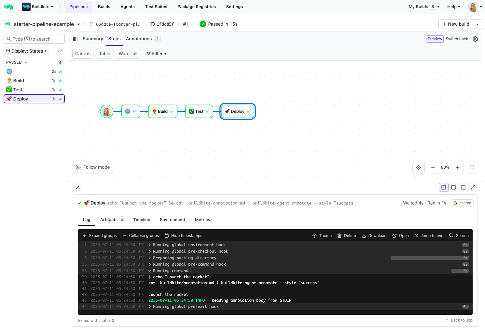
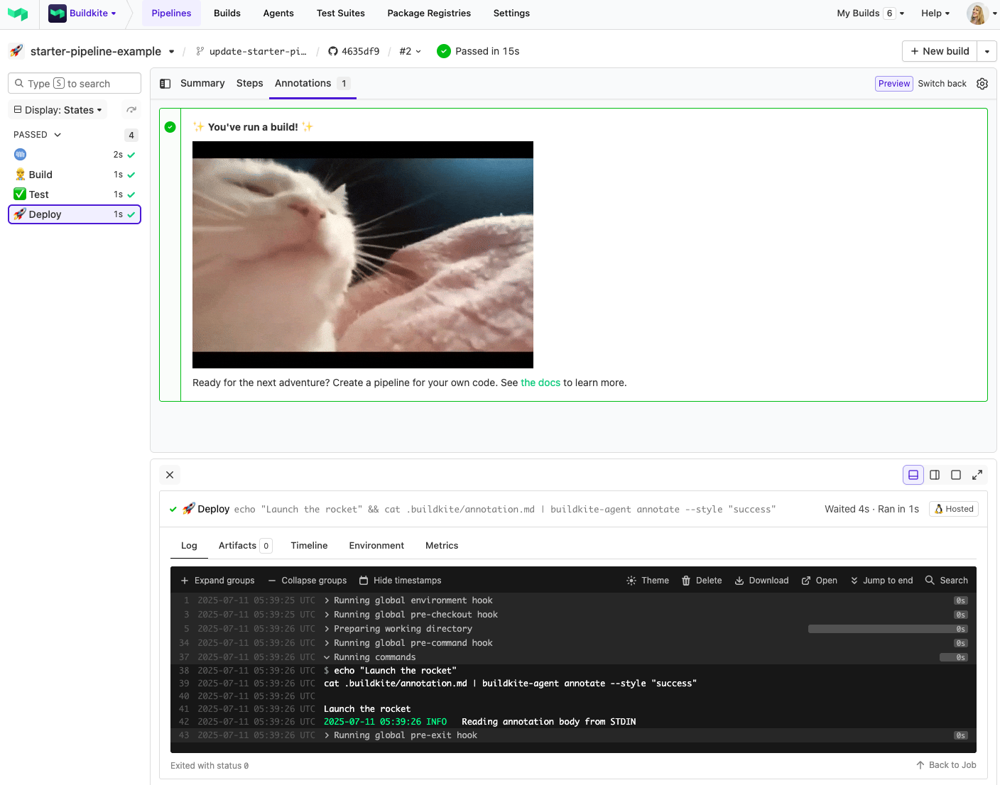

## Buildkite Starter Pipeline Example!!

This repository is a friendly starting point for learning how [Buildkite](https://buildkite.com/) pipelines work.

👉 **See this example in action:** [buildkite/starter-pipeline-example](https://buildkite.com/buildkite/starter-pipeline-example/builds/latest?branch=main)

See the full [Getting Started Guide](https://buildkite.com/docs/guides/getting-started) for step-by-step instructions on how to get this running, or try it yourself:

> 📸 **Screenshot 1:** A simple 3-step pipeline in action - building, testing, and deploying your rocket 🚀

> 📸 **Screenshot 2:** The final deploy step adds a success annotation to your build - and yes, you can add GIFs too!

<!-- docs:start -->
## 🛠 How it works

The pipeline is platform agnostic, which means it can run on any infrastructure. Its behavior is defined in [.buildkite/pipeline.yml](.buildkite/pipeline.yml), including steps to build, test, and deploy. These steps describe launching a shiny new rocket to the moon. 🚀🌕

This pipeline demonstrates a typical Buildkite flow:

1. **Build** step - placeholder command to "build the rocket"
2. **Test** step - placeholder test stage, depends on `build`
3. **Deploy** step - echoes a launch message and uses `buildkite-agent annotate` to display an annotation

You can replace each of these steps with real commands suited to your own project.

## Create a pipeline

If you need help setting up Buildkite, see [Getting started](https://buildkite.com/docs/tutorials/getting-started).

With Buildkite setup, you can quickly create a new pipeline by selecting **Add to Buildkite**. This prefills the pipeline details using [template.yml](.buildkite/template.yml) and includes a command to upload the pipeline definition in [pipeline.yml](.buildkite/pipeline.yml).

## Requirements

None! This example runs on Buildkite-hosted agents, so there's nothing to install or configure.

Just click **Add to Buildkite** above and you’re ready to go.

> 💡 If you’d like to run this on your own infrastructure instead, see [Buildkite Agent setup](https://buildkite.com/docs/agent).

<!-- docs:end -->
## License

See [LICENSE](LICENSE) (MIT)
